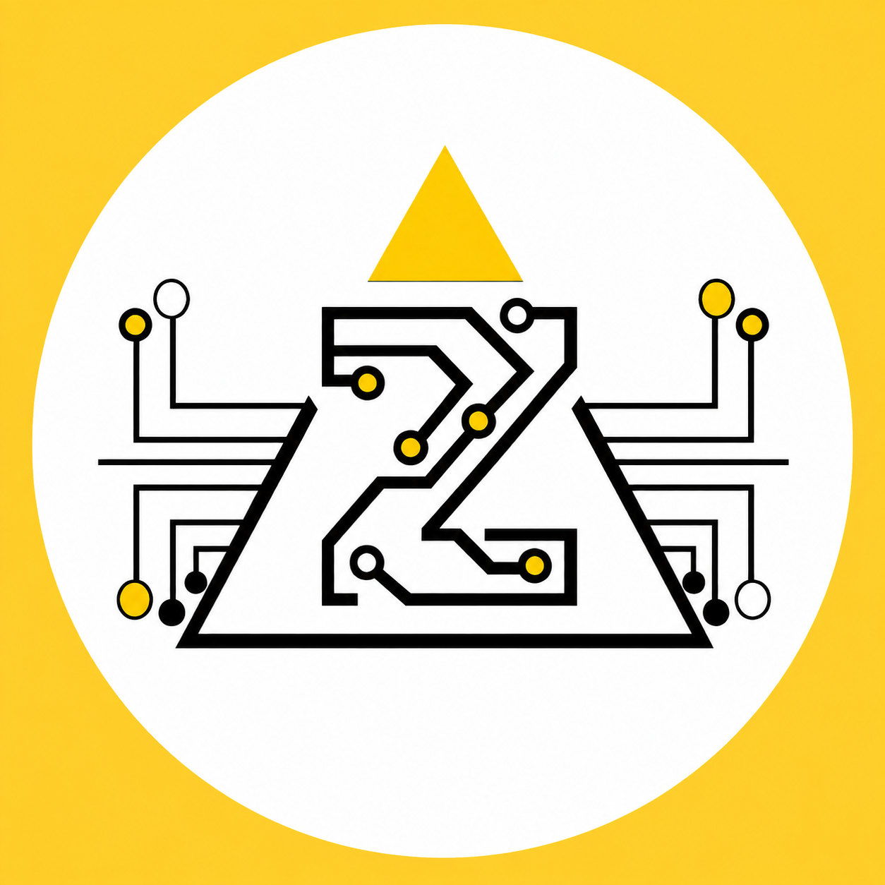
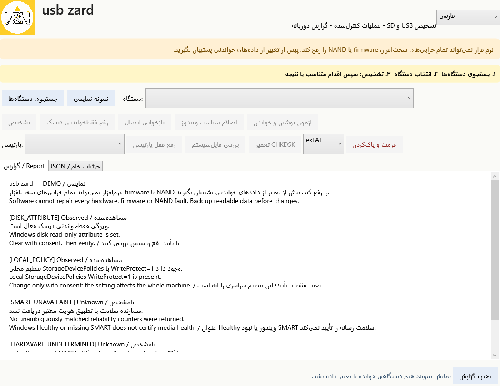
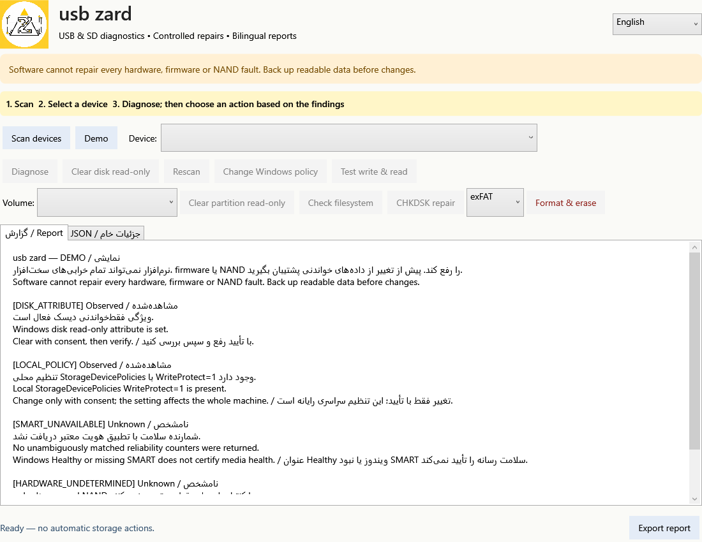

<p align="center"></p>

<h1 align="center">usb zard</h1>
<p align="center">Windows USB & SD diagnostics with controlled repair actions<br>تشخیص مشکلات فلش و کارت حافظه با عملیات تعمیر کنترل‌شده</p>

[راهنمای کامل فارسی](README.fa.md) · [Complete English guide](README.en.md) · [Downloads / دانلود](https://github.com/amirtmi/usb-zard/releases)

**English:** usb zard is a Windows desktop utility for investigating USB flash drive and SD/microSD write-protection problems. It distinguishes Windows read-only flags from RAW/unrecognized filesystems, inspects the device's reported writable state, and offers explicitly confirmed standard repair, formatting and small write/read verification actions.

**فارسی:** usb zard یک برنامه ویندوزی برای بررسی مشکل محافظت نوشتن فلش USB و کارت SD/microSD است. برنامه ویژگی فقط‌خواندنی ویندوز را از فایل‌سیستم RAW یا ناشناخته تفکیک می‌کند، وضعیت اعلام‌شده توسط دستگاه را می‌خواند و عملیات استاندارد تعمیر، فرمت و آزمون کوچک نوشتن/خواندن را فقط با تأیید کاربر اجرا می‌کند.

> **No software can repair every hardware, firmware or NAND write-protection fault on every device. Back up readable data first.**
>
> **هیچ نرم‌افزاری نمی‌تواند تمام قفل‌های سخت‌افزاری، firmware یا خرابی NAND را روی همه دستگاه‌ها رفع کند. ابتدا از داده‌های قابل‌خواندن پشتیبان بگیرید.**

## Highlights / امکانات اصلی

| Feature | قابلیت |
|---|---|
| Persian and English interface and TXT/JSON reports | رابط فارسی/انگلیسی و گزارش TXT/JSON |
| USB/SD/MMC detection, identity, serial and reported capacity | شناسایی دستگاه، هویت، سریال و ظرفیت اعلام‌شده |
| RAW filesystem and unsupported attribute detection | تشخیص RAW و ویژگی‌های پشتیبانی‌نشده |
| Native writable query and bounded first-block read | پرس‌وجوی بومی قابلیت نوشتن و خواندن محدود ابتدای رسانه |
| Read-only attribute and local Windows policy controls | مدیریت ویژگی فقط‌خواندنی و سیاست محلی ویندوز |
| Guarded CHKDSK and optional exFAT/NTFS/FAT32 quick format | CHKDSK کنترل‌شده و فرمت سریع اختیاری |
| 1 MiB write/read verification with SHA-256 | آزمون نوشتن/خواندن ۱ MiB با SHA-256 |
| System-disk exclusion and typed confirmation | جلوگیری از تغییر دیسک سیستمی و تأیید با تایپ عبارت |

## Download and run / دریافت و اجرا

Download the Windows x64 ZIP from [Releases](https://github.com/amirtmi/usb-zard/releases), extract it and run **usb zard.exe**. The self-contained build does not require a separate .NET runtime installation. Administrator access is requested through Windows UAC.

بسته Windows x64 را از [Releases](https://github.com/amirtmi/usb-zard/releases) دریافت و استخراج کنید و **usb zard.exe** را اجرا کنید. نسخه مستقل به نصب جداگانه .NET نیاز ندارد و از طریق UAC دسترسی مدیر درخواست می‌کند.

The executable is unsigned. Check the release checksum and obtain it from this repository. / فایل اجرایی امضای تجاری ندارد؛ آن را از همین مخزن دریافت و هش منتشرشده را بررسی کنید.

## Screenshots / تصاویر رابط




Screenshots show synthetic demonstration data. / تصاویر با اطلاعات نمایشی ساخته شده‌اند.

## Build / ساخت

Windows x64 and the .NET 8 SDK are required. No third-party NuGet package is used by the application.

```powershell
dotnet build UsbWriteGuard.csproj -c Release
dotnet publish UsbWriteGuard.csproj -c Release -r win-x64 --self-contained true -p:PublishSingleFile=true -p:IncludeNativeLibrariesForSelfExtract=true -p:DebugType=None -p:DebugSymbols=false -o release
```

For architecture, all operations, safeguards, tests and limitations, read the [English guide](README.en.md) or [راهنمای فارسی](README.fa.md).

## Validation / اعتبارسنجی

The project includes **13 diagnosis/error assertions**, **9 mocked guard rejection cases**, **18 mocked worker assertions**, and WPF language/layout/RAW action-gating checks. These tests do not certify every physical device or prove that a damaged flash drive can be repaired.

پروژه شامل **۱۳ بررسی تشخیص و توضیح خطا**، **۹ سناریوی رد عملیات ناامن**، **۱۸ بررسی اجرای شبیه‌سازی‌شده فرمان‌ها** و آزمون رابط WPF و محدودیت عملیات RAW است. موفقیت آزمون‌های نرم‌افزار تضمین تعمیر همه فلش‌های خراب نیست.

See [VALIDATION.md](VALIDATION.md) for scope and [CHANGELOG.md](CHANGELOG.md) for version changes.
